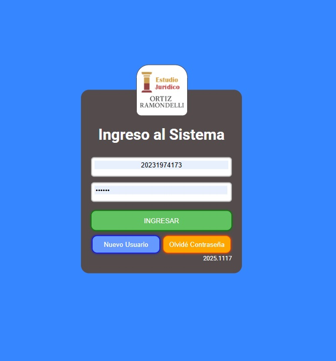
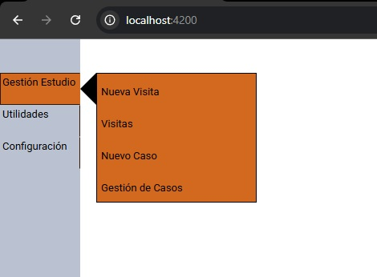
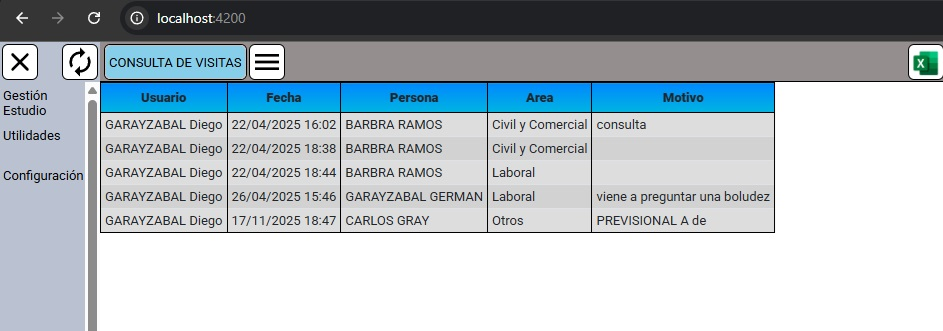
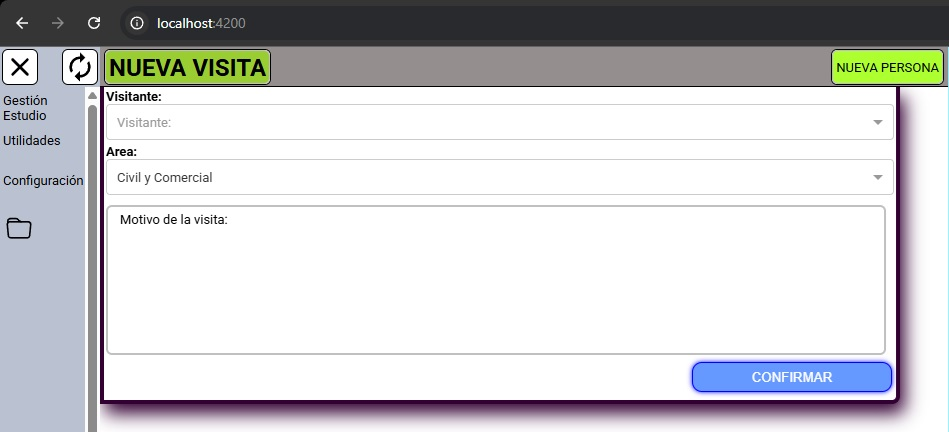
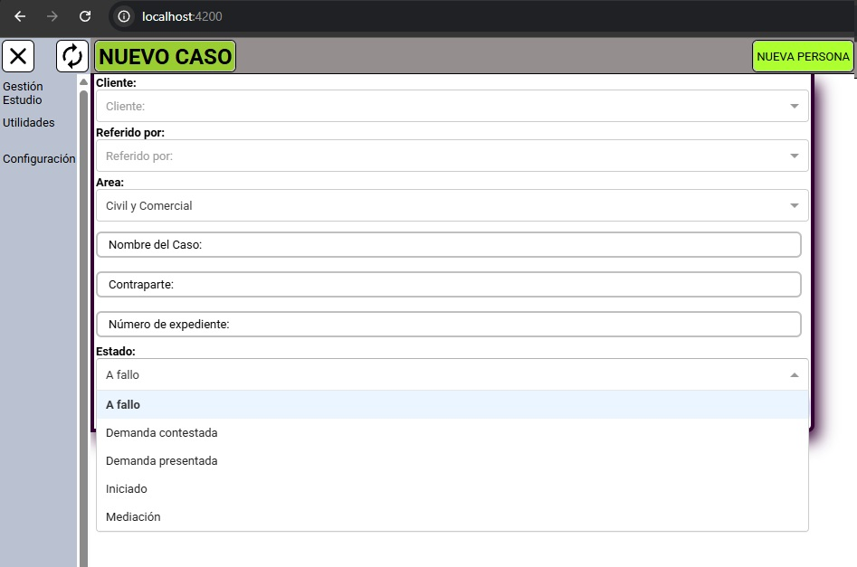
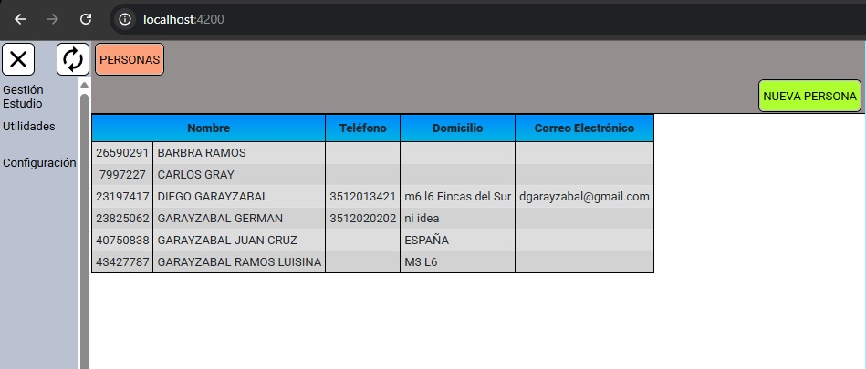
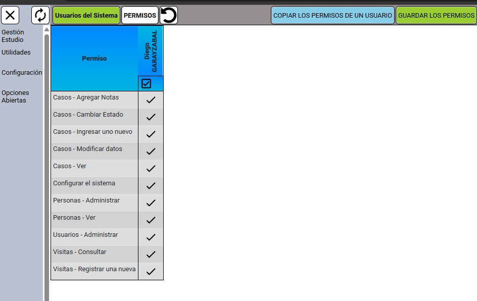
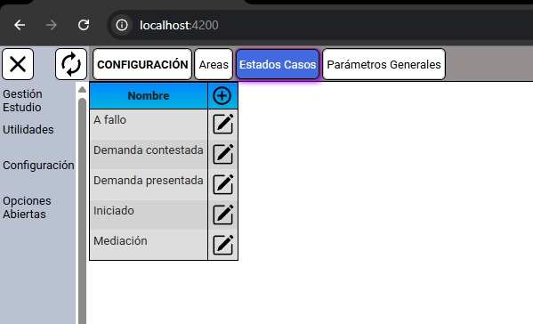

# Demo Sistema para Estudio Jurídico – Angular

Este proyecto es una demostración de un sistema desarrollado en **Angular** para un estudio jurídico.  
Permite registrar **visitas al estudio**, gestionar **casos**, y realizar el seguimiento de **etapas** de cada expediente.  
La finalidad del repositorio es permitir la evaluación técnica de la arquitectura, estructura y buenas prácticas de desarrollo frontend.

---

## 🚀 Tecnologías utilizadas

- **Angular (12 → 19)**
- **TypeScript**
- **HTML / SCSS**
- **Angular Router**
- **Standalone Components**
- **Arquitectura modular**
- **RxJS (servicios y estados)**
- **Componentes reutilizables**

---

## 📌 Funcionalidades principales

### ✔ Registro de visitas
- Carga de nuevas visitas
- Fecha, motivo y datos de la persona
- Listado con búsqueda y filtros

### ✔ Gestión de casos
- Alta y edición de casos
- Datos básicos del cliente
- Tipo de caso y estado general
- Observaciones y notas internas

### ✔ Etapas del caso
- Registro de cada etapa del proceso
- Edición y eliminación
- Orden temporal del expediente
- Control visual del avance

### ✔ Componentes reutilizables
- Inputs personalizados  
- Selects dinámicos  
- Tablas responsivas  
- Filtros y pipes  
- Paginador  
- Visualización de PDFs  
- Íconos SVG integrados  

---

## 📂 Estructura general del proyecto

src/
├── app/
│ ├── login/
│ ├── opciones/
│ │ ├── menu-casos/
│ │ ├── menu-casos-nuevo/
│ │ ├── menu-visitas/
│ │ ├── menu-visitas-nueva/
│ ├── componentes/
│ ├── tuberias/
│ ├── utilidades/
│ ├── configuracion/
│ ├── funciones.service.ts
│ ├── pdfs.service.ts
│ ├── globales.ts
│
├── assets/
├── environments/
├── index.html
├── styles.scss


---

## 🛠 Instalación

Clonar el repositorio:

```bash
git clone https://github.com/diegogarayzabal/demo-angular.git

Instalar dependencias:

npm install

▶ Ejecutar la aplicación
ng serve --open


La aplicación se abrirá automáticamente en:

http://localhost:4200/


Nota: Esta demo contiene únicamente la parte frontend.
No incluye backend PHP ni configuraciones privadas del sistema real.

🎯 Objetivo del repositorio

Mostrar dominio práctico de Angular

Presentar un ejemplo funcional y organizado

Permitir evaluación de arquitectura, módulos y componentes

Exponer capacidad de diseño frontend aplicado a un caso real

👨‍💻 Autor

Diego Garayzabal
Senior Full-Stack Developer
Angular • PHP • MySQL • Arquitectura de Software
LinkedIn: https://linkedin.com/in/diego-garayzabal

📄 Licencia

Proyecto publicado únicamente con fines demostrativos.


## 📸 Capturas de pantalla

### Login


### Menú principal


### Registro de visitas


### Nueva visita


### Casos (listado)


### Nuevo caso


### Personas (gestión)


### Usuarios y permisos


### Configuración general

